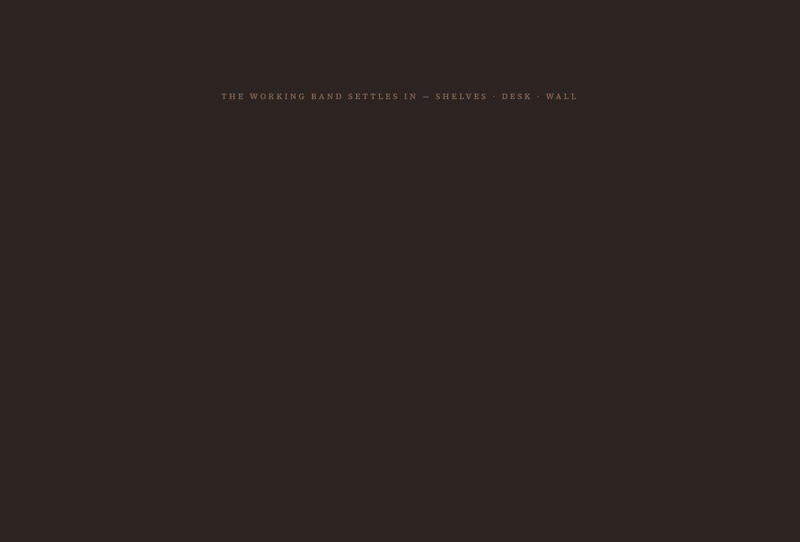

# The Word and the Way


A personal spiritual application built as **one room, not a dashboard of features**. You
enter facing the **Altar of Remembrance**, with the **Desk**, **Shelves**, **Wall**, and
**Window** framing it. Everything in the room is one object — an **Encounter** — moving
along a single path: **Receive → Reflect → Declare → Carry → Witness**.

> The whole product is a single page. "Stations" are *furniture*, not routed pages — a
> deliberate constraint that drove the architecture. See
> [`docs/room-architecture.md`](docs/room-architecture.md) for the north-star design.

**Stack:** React 18 · TypeScript (strict) · Tailwind v4 · Vite  ·  FastAPI · SQLAlchemy 2.0 ·
Pydantic v2 · SQLite  ·  local RAG via ChromaDB + Ollama. Offline-first — no cloud, no
external dependencies at runtime.

---

## The room, settling in

As you enter, the working band — **Shelves · Desk · Wall** — settles into view, staggered
left to right (scroll-triggered, honoring `prefers-reduced-motion`).



---

## Why this is interesting (engineering highlights)

**One data spine, not six feature tables.** A journaled word, a declaration, a carried
prayer, and a testimony aren't different entities — they're the same `Encounter` at
different points on a lifecycle (`stage` enum). This collapses what would normally be
several tables and CRUD surfaces into one object the whole UI reads and writes. A new
lifecycle step is a new enum value, not a migration.

**The "carry" mechanic models meditation over time.** Carrying an Encounter across seasons
increments `carry_count`; at 3 it becomes a *Cornerstone*, automatically promoted in stage
and inscribed on the Altar. Features layer onto this single primitive instead of bolting on
new ones — e.g. "keep a verse to meditate on" simply creates an Encounter that flows into
the existing carry loop.

**Local-first AI / RAG with graceful degradation.** Semantic search over a confessions
corpus uses **Ollama (`nomic-embed-text`) embeddings** persisted in **ChromaDB** — all on
the user's machine, zero API cost. If Ollama is unreachable, search **falls back to title
filtering** rather than failing. This degradation contract is a first-class design rule, not
an afterthought.

**Offline-first by design.** SQLite on disk; scripture fetched once from a public API is
**cached locally** so re-reads need no network. The room always opens, internet or not.

**Type-safety across the wire.** Pydantic schemas validate every request/response and
generate OpenAPI docs; a hand-written typed `api.ts` mirrors them on the frontend; TypeScript
runs in `strict` mode with `noUnusedLocals`/`noUnusedParameters` (the build fails on dead
code). The contract is enforced at both ends, not assumed.

**Pragmatic migrations.** `create_all` builds new tables but never alters existing ones, so
schema evolution (e.g. adding `reading_log.goal_id`) is handled by a guarded, idempotent
`ALTER TABLE` in the app lifespan that **preserves existing user data** on upgrade.

**Domain-correct details.** Chapter navigation rolls *across books* using a canonical
66-book table (James 5 → 1 Peter 1; stops at Genesis 1 / Revelation 22). A configurable
reading goal supports *N chapters per day or week* with a **pace-aware streak** that counts
consecutive periods the quota was met (bucketed by day or ISO week).

---

## Architecture

```
┌─────────────── Browser (one page) ───────────────┐
│  Room.tsx — fetches once, sorts each Encounter    │
│  to its station by lifecycle stage                │
│   Altar · Desk · Shelves · Wall · Window          │
└───────────────────────┬───────────────────────────┘
              typed api.ts │  Vite proxies /api → :8000
┌───────────────────────▼───────────────────────────┐
│  FastAPI (thin routers) → services                 │
│   reading · prayer · bible · rag                   │
│  Pydantic schemas · SQLAlchemy 2.0 (Mapped)        │
│  SQLite (the Encounter spine)                      │
│  ChromaDB ⇄ Ollama embeddings (local RAG)          │
└────────────────────────────────────────────────────┘
```

Routers stay thin; logic lives in service modules. On startup the lifespan creates tables,
runs migrations, seeds idempotently, syncs the confessions corpus from disk, and indexes new
entries into ChromaDB — all safe to re-run.

### Stations → lifecycle stage

| Station     | Stage                 | Component                |
|-------------|-----------------------|--------------------------|
| The Altar   | Carry (cornerstones)  | `components/Altar.tsx`   |
| The Desk    | Receive · Reflect     | `components/Desk.tsx`    |
| The Shelves | Archive (seasons)     | `components/Shelves.tsx` |
| The Wall    | Declare               | `components/Wall.tsx`    |
| The Window  | Witness               | `components/Window.tsx`  |

---

## Selected features

- **Daily reading with configurable goals** — choose a book/chapter range and a pace
  (chapters per day or week); pace-aware streak; cross-book navigation; a weekly look-back.
- **Keep a verse to meditate on** — tap a verse while reading; it becomes an Encounter that
  carries toward the Altar, and stays highlighted on re-read. A "Dwelling on" strip lists
  what you're holding and reopens any chapter on tap.
- **The Wall** — a corpus of confessions with **semantic search** (local embeddings) and a
  War Room proclamation mode.
- **The Watch** — a daily prayer tracker (standing + personal foci) with its own streak.
- **Seasons** — the only calendar the room knows; Encounters are organized by season, and
  crossing a season can push carried words past the cornerstone threshold.

---

## Run it locally

Two local processes, offline-first (SQLite on disk, no cloud).

**Backend** (FastAPI, port 8000):

```bash
cd backend
python3 -m venv .venv
.venv/bin/pip install -r requirements.txt
.venv/bin/uvicorn app.main:app --reload --port 8000
```

The database is created and seeded on first boot (`backend/the_word_and_the_way.db`).
Interactive API docs at http://127.0.0.1:8000/docs.

**Frontend** (Vite + React, port 5173):

```bash
cd frontend
npm install
npm run dev      # proxies /api → http://127.0.0.1:8000
```

Open http://localhost:5173.

**Optional — semantic search:** install [Ollama](https://ollama.com) and pull the embedding
model. Without it, the Wall gracefully falls back to title filtering.

```bash
ollama pull nomic-embed-text
```

---

## Repo layout

```
backend/   FastAPI · SQLAlchemy · SQLite — the Encounter spine + services
frontend/  React · TypeScript · Tailwind v4 · Vite — the one room (UI)
docs/      room-architecture.md (north star), confessions corpus, design notes
```

Each folder carries a `CLAUDE.md` documenting its conventions and non-obvious decisions.

---

## Notes on design philosophy

The hardest constraint in this project wasn't technical — it was resisting the urge to turn
each station into a routed page or a feature grid. Holding the "one room, one Encounter"
model forced better data design: a single lifecycle, reusable mechanics (carry, season,
keep), and UI that composes from one source of truth. The result is a small, coherent system
where new capabilities are usually *new uses of an existing primitive* rather than new
subsystems.
